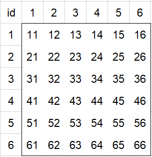
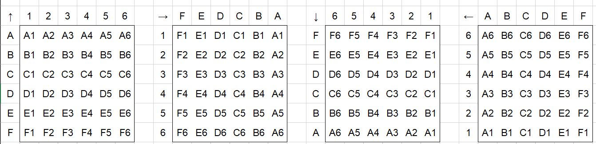

# 夏末-宗长计算器

#### 介绍
[夏末-宗长计算器 summerendffxiv.club-foxcalculator](https://leejswit-hcn.github.io/foxcalculator/)

根据绝杀宗长表格数据构建的快速查询计算器

#### 算法

架构：非常非常原始的前端三件套

原表格共16组数据，数据视为4组（A、B、C、D）旋转4个方向，在每组内方向不同但宗长位置相同。

6✖️6的按钮组的ID定义规则：

分成两组定义方式，

原始ID：

html传入的ID，根据从左到右，从上到下的顺序，依次将按钮ID定义为11->66，对应坐标(1，1)->(6，6)，后续通过除法和取余获取坐标值，如34/10=3，34%10=4.

运算ID：

根据方向分成上下左右共4组

运算ID根据当前方向转换成原始ID，转换方法见：plugins.js 39-190行。

显示宗长逻辑：纯if判断

预选框逻辑：条件遍历

---

>代码可能有点小小的bug，但是不影响使用。推荐选点也不打算做了（两年前的代码已经看不懂啦)
>
>如果7.0幻巧拼图有改动再更新，有选点问题可以提issue，我会及时修改。
